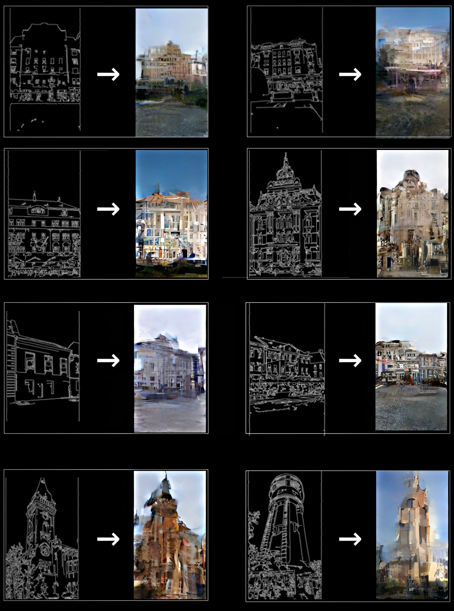

# img2img_DiT

A PyTorch implementation of an image-to-image diffusion transformer that learns to generate one half of an image from the other using a latent diffusion setup with CLIP conditioning.




## Overview

This project combines:

- a pretrained Stable Diffusion VAE for latent encoding/decoding
- a CLIP image encoder for conditioning signals
- a DiT-style transformer backbone for denoising in latent space
- a linear noise scheduler for diffusion training
- LPIPS + diffusion MSE objectives for image reconstruction quality

The data pipeline loads paired image halves from each source image and trains the model to reconstruct the target half from the condition half.

## Repository structure

- `config/config.json` — training and model configuration
- `data/dataloader.py` — dataset loader and paired image split logic
- `DDPM/DDPM.py` — diffusion noise scheduler
- `DiT_model/` — DiT transformer model and embeddings
- `VAE/VAE.py` — VAE wrapper around `diffusers` AutoencoderKL
- `training/train.py` — training entry point
- `training/train_script.py` — training loop logic
- `pretrained/` — local pretrained model assets
- `notebooks/` — inference and plotting notebooks
- `results/` — generated outputs and training artifacts

## Requirements

Create a Python environment and install dependencies:

```bash
python -m venv .venv
source .venv/bin/activate
pip install -r requirements.txt
```

The project expects a PyTorch installation compatible with your GPU/CPU environment. On systems with CUDA, install the appropriate PyTorch build first, then install the rest from `requirements.txt`.

## Configuration

Training parameters are defined in `config/config.json`.

Key settings include:

- model dimensions and transformer depth
- diffusion scheduler parameters
- training epochs and learning rate
- dataset folder name
- paths to pretrained checkpoints
- save settings for the DiT model

Example:

```json
"Data": {
  "dataset": "cars"
},
"Training": {
  "epochs": 1000,
  "batch_size": 1,
  "learning_rate": 1e-4
}
```

The dataset folder name is used to point the loader at a directory such as `cars/` or `buildings/`.

## Dataset format

The project expects a folder of training images, where each image contains two halves:

- left side = condition image
- right side = target image

The loader splits every image at its midpoint width:

```python
img1, img2 = img[:, :img.shape[1]//2, :], img[:, img.shape[1]//2:, :]
```

So each input sample is a paired image-to-image training example.

## Pretrained assets

The training script expects the following local assets to exist:

- `pretrained/sd-vae-ft-mse/`
- `pretrained/models--timm--vit_large_patch14_clip_224.openai/.../open_clip_model.safetensors`
- `pretrained/vgg.pth`

These are referenced in `config/config.json` under `Pretrained`.

## Training

From the project root:

```bash
python -m training.train
```

This loads the config, constructs the VAE, CLIP model, DiT model, and diffusion scheduler, then runs the training loop defined in `training/train_script.py`.

### HPC / PBS training

The repo also includes a PBS script for cluster execution:

```bash
qsub training/train.pbs
```

## Outputs

The trained model is saved according to the settings in `config/config.json` under `saves`.

Typical output:

- `img2img_DiT.pth`
- periodic checkpoints during training
- metrics and logs from the training run

## Notes

- Training is configured for GPU execution when available; otherwise it falls back to CPU.
- Some warnings are intentionally suppressed in the training script to reduce noise from older dependencies.
- The project is designed for experimentation and research rather than production deployment.

## Example output

The README originally referenced a compiled result image, which may live under `results/` depending on your environment.

## Citation / project intent

This repository is a research-oriented image translation model based on diffusion transformer concepts in latent space. It is primarily intended for experimentation, custom datasets, and model training in the `img2img` style.
